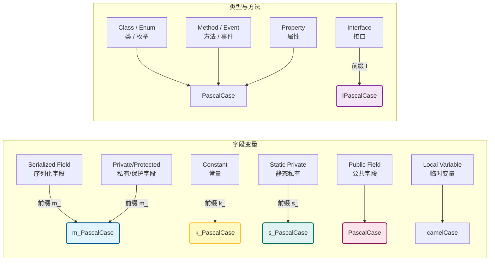

---
title: C# 代码规范
published: 2026-01-31
pinned: false
description: 本文定义了项目中 C# 代码的命名约定与格式化标准。本规范旨在统一团队代码风格，提高代码的可读性与维护性。
image: "https://upload.wikimedia.org/wikipedia/commons/d/d2/C_Sharp_Logo_2023.svg"
tags:
  - C#
  - Coding
category: Coding Style
licenseName: ""
author: Lewis
draft: false
---

:::note
**本文的代码命名规范仅作为参考，如果你有自己的个人命名规范或团队命名规范，请坚持使用！**
:::

---
## 命名逻辑可视化图谱

下图展示了不同变量类型与其对应的前缀/格式逻辑：


---
## 命名规范

| 类别 (Category)   | 访问修饰符/类型（Types）                | 命名规则 (Rule)       | 示例 (Example)       |
| :-------------- | :----------------------------- | :---------------- | :----------------- |
| **字段 (Fields)** | `[SerializeField]` / `private` | `m_` + PascalCase | `m_PlayerHealth`   |
|                 | `protected`                    | `m_` + PascalCase | `m_ArmorValue`     |
|                 | `public`                       | PascalCase        | `PlayerScore`      |
| **静态 (Static)** | `private static`               | `s_` + PascalCase | `s_Instance`       |
|                 | `public static`                | PascalCase        | `Instance`         |
| **常量 (Const)**  | `const`                        | `k_` + PascalCase | `k_MaxSpeed`       |
| **属性 (Props)**  | `public` / `private`           | PascalCase        | `Health`           |
| **类型 (Types)**  | `class` / `struct` / `enum`    | PascalCase        | `PlayerController` |
|                 | `interface`                    | `I` + PascalCase  | `IDamageable`      |
| **其他**          | `method` (方法)                  | PascalCase        | `GetPosition()`    |
|                 | `event` (事件)                   | PascalCase        | `OnLevelStart`     |

---
## 代码格式

为了保持代码整洁，我们遵循以下排版规则：

1.  **缩进 (Indentation)**
* 使用 **4 个空格** (Space)，不使用 Tab。
2.  **大括号 (Braces)**
* **换行** (Allman 风格)：所有大括号 `{` 必须另起一行。
3.  **空格 (Spacing)**
* 控制流关键字 (`if`, `for`, `while`, `switch`, `catch`) 后必须加空格。
* *Good:* `if (condition)`
* ~~*Bad:* `if(condition)`~~
---
## 代码示例

```csharp
using UnityEngine;
using System;

// 接口：I + PascalCase
public interface IInteractable 
{
    void Interact();
}

// 类：PascalCase
public class PlayerController : MonoBehaviour, IInteractable
{
    // 常量：k_ + PascalCase
    private const float k_MaxSpeed = 10.0f;

    // 静态私有：s_ + PascalCase
    private static PlayerController s_Instance;

    // 静态公开：PascalCase
    public static PlayerController Instance => s_Instance;

    // 序列化字段：m_ + PascalCase
    [SerializeField] private int m_Health = 100;
    
    // 保护字段：m_ + PascalCase
    protected float m_CurrentSpeed;

    // 私有字段：m_ + PascalCase
    private bool m_IsDead;

    // 属性：PascalCase
    public int Health => m_Health;

    // 事件：PascalCase
    public event Action OnPlayerDied;

    // 方法：PascalCase
    private void Awake()
    {
        // 关键字后加空格，大括号换行
        if (s_Instance == null) 
        {
            s_Instance = this;
        }
    }

    // 方法：PascalCase
    public void TakeDamage(int amount)
    {
        m_Health -= amount;

        if (m_Health <= 0)
        {
            Die();
        }
    }

    private void Die()
    {
        m_IsDead = true;
        OnPlayerDied?.Invoke();
    }

    public void Interact()
    {
        // 逻辑代码...
    }
}
```
---
## 编辑器配置
主流IDE如JetBrains Rider和Visual Studio都完全支持通过写入`.editorconfig`配置文件来统一管理代码风格，避免不同项目或不同设备之间重复编辑。

在你的C#项目根目录中（与`.sln`文件同级的目录），新建`NamingStyle.editorconfig`文件，并写入以下内容。
```ini
# editorconfig.org

# top-most EditorConfig file
root = true

# Default settings:
# A newline ending every file
# Use 4 spaces as indentation
[*]
charset = utf-8
insert_final_newline = true
indent_style = space
indent_size = 4
trim_trailing_whitespace = true

# Generated code
[*{.g.cs,.link.cs}]
generated_code = true

# C# files
[*.cs]
# New line preferences
csharp_new_line_before_open_brace = all
csharp_new_line_before_else = true
csharp_new_line_before_catch = true
csharp_new_line_before_finally = true
csharp_new_line_before_members_in_object_initializers = true
csharp_new_line_before_members_in_anonymous_types = true
csharp_new_line_between_query_expression_clauses = true

# Indentation preferences
csharp_indent_block_contents = true
csharp_indent_braces = false
csharp_indent_case_contents = true
csharp_indent_case_contents_when_block = true
csharp_indent_switch_labels = true
csharp_indent_labels = one_less_than_current

# Modifier preferences
csharp_preferred_modifier_order = public,private,protected,internal,file,static,extern,new,virtual,abstract,sealed,override,readonly,unsafe,required,volatile,async:suggestion

# Avoid this. unless absolutely necessary
dotnet_style_qualification_for_field = false:suggestion
dotnet_style_qualification_for_property = false:suggestion
dotnet_style_qualification_for_method = false:suggestion
dotnet_style_qualification_for_event = false:suggestion

# Types: use keywords instead of BCL types, and permit var only when the type is clear
csharp_style_var_for_built_in_types = false:suggestion
csharp_style_var_when_type_is_apparent = false:none
csharp_style_var_elsewhere = false:suggestion
dotnet_style_predefined_type_for_locals_parameters_members = true:suggestion
dotnet_style_predefined_type_for_member_access = true:suggestion

# 1. Interface: I + PascalCase
dotnet_naming_rule.interface_should_be_i_pascal_case.severity = suggestion
dotnet_naming_rule.interface_should_be_i_pascal_case.symbols = interface_group
dotnet_naming_rule.interface_should_be_i_pascal_case.style = i_prefix_style

dotnet_naming_symbols.interface_group.applicable_kinds = interface
dotnet_naming_style.i_prefix_style.required_prefix = I
dotnet_naming_style.i_prefix_style.capitalization = pascal_case

# 2. Constants: k_ + PascalCase
dotnet_naming_rule.constant_fields_should_be_k_pascal_case.severity = suggestion
dotnet_naming_rule.constant_fields_should_be_k_pascal_case.symbols = constant_fields
dotnet_naming_rule.constant_fields_should_be_k_pascal_case.style = k_prefix_style

dotnet_naming_symbols.constant_fields.applicable_kinds = field
dotnet_naming_symbols.constant_fields.required_modifiers = const
dotnet_naming_style.k_prefix_style.required_prefix = k_
dotnet_naming_style.k_prefix_style.capitalization = pascal_case

# 3. Static Fields: s_ + PascalCase
dotnet_naming_rule.static_fields_should_have_prefix.severity = suggestion
dotnet_naming_rule.static_fields_should_have_prefix.symbols = static_fields
dotnet_naming_rule.static_fields_should_have_prefix.style = s_prefix_style

dotnet_naming_symbols.static_fields.applicable_kinds = field
dotnet_naming_symbols.static_fields.required_modifiers = static
dotnet_naming_symbols.static_fields.applicable_accessibilities = private, protected, internal, protected_internal, private_protected
dotnet_naming_style.s_prefix_style.required_prefix = s_
dotnet_naming_style.s_prefix_style.capitalization = pascal_case

# 4. Private/Protected/Serialized Fields: m_ + PascalCase
dotnet_naming_rule.private_fields_should_have_prefix.severity = suggestion
dotnet_naming_rule.private_fields_should_have_prefix.symbols = private_fields
dotnet_naming_rule.private_fields_should_have_prefix.style = m_prefix_style

dotnet_naming_symbols.private_fields.applicable_kinds = field
dotnet_naming_symbols.private_fields.applicable_accessibilities = private, protected, internal, protected_internal, private_protected
dotnet_naming_style.m_prefix_style.required_prefix = m_
dotnet_naming_style.m_prefix_style.capitalization = pascal_case

# 5. Public Fields: PascalCase
dotnet_naming_rule.public_fields_should_be_pascal_case.severity = suggestion
dotnet_naming_rule.public_fields_should_be_pascal_case.symbols = public_fields
dotnet_naming_rule.public_fields_should_be_pascal_case.style = pascal_case_style

dotnet_naming_symbols.public_fields.applicable_kinds = field
dotnet_naming_symbols.public_fields.applicable_accessibilities = public
dotnet_naming_style.pascal_case_style.capitalization = pascal_case

# 6. Types & Members: PascalCase
dotnet_naming_rule.types_and_members_should_be_pascal_case.severity = suggestion
dotnet_naming_rule.types_and_members_should_be_pascal_case.symbols = types_and_members
dotnet_naming_rule.types_and_members_should_be_pascal_case.style = pascal_case_style

dotnet_naming_symbols.types_and_members.applicable_kinds = class, struct, enum, method, property, event, delegate, local_function

csharp_using_directive_placement = outside_namespace:suggestion
dotnet_sort_system_directives_first = true
csharp_prefer_braces = true:silent
csharp_preserve_single_line_blocks = true:none
csharp_preserve_single_line_statements = false:none
csharp_prefer_static_local_function = true:suggestion
csharp_prefer_simple_using_statement = false:none
csharp_style_prefer_switch_expression = true:suggestion
dotnet_style_readonly_field = true:suggestion

# Expression-level preferences
dotnet_style_object_initializer = true:suggestion
dotnet_style_collection_initializer = true:suggestion
dotnet_style_explicit_tuple_names = true:suggestion
dotnet_style_coalesce_expression = true:suggestion
dotnet_style_null_propagation = true:suggestion
dotnet_style_prefer_is_null_check_over_reference_equality_method = true:suggestion
dotnet_style_prefer_inferred_tuple_names = true:suggestion
dotnet_style_prefer_inferred_anonymous_type_member_names = true:suggestion
dotnet_style_prefer_auto_properties = true:suggestion
dotnet_style_prefer_conditional_expression_over_assignment = true:silent
dotnet_style_prefer_conditional_expression_over_return = true:silent
csharp_prefer_simple_default_expression = true:suggestion

# Expression-bodied members
csharp_style_expression_bodied_methods = true:silent
csharp_style_expression_bodied_constructors = true:silent
csharp_style_expression_bodied_operators = true:silent
csharp_style_expression_bodied_properties = true:silent
csharp_style_expression_bodied_indexers = true:silent
csharp_style_expression_bodied_accessors = true:silent
csharp_style_expression_bodied_lambdas = true:silent
csharp_style_expression_bodied_local_functions = true:silent

# Pattern matching
csharp_style_pattern_matching_over_is_with_cast_check = true:suggestion
csharp_style_pattern_matching_over_as_with_null_check = true:suggestion
csharp_style_inlined_variable_declaration = true:suggestion

# Null checking preferences
csharp_style_throw_expression = true:suggestion
csharp_style_conditional_delegate_call = true:suggestion

# Other features
csharp_style_prefer_index_operator = false:none
csharp_style_prefer_range_operator = false:none
csharp_style_pattern_local_over_anonymous_function = false:none

# Space preferences
csharp_space_after_cast = false
csharp_space_after_colon_in_inheritance_clause = true
csharp_space_after_comma = true
csharp_space_after_dot = false
csharp_space_after_keywords_in_control_flow_statements = true
csharp_space_after_semicolon_in_for_statement = true
csharp_space_around_binary_operators = before_and_after
csharp_space_around_declaration_statements = do_not_ignore
csharp_space_before_colon_in_inheritance_clause = true
csharp_space_before_comma = false
csharp_space_before_dot = false
csharp_space_before_open_square_brackets = false
csharp_space_before_semicolon_in_for_statement = false
csharp_space_between_empty_square_brackets = false
csharp_space_between_method_call_empty_parameter_list_parentheses = false
csharp_space_between_method_call_name_and_opening_parenthesis = false
csharp_space_between_method_call_parameter_list_parentheses = false
csharp_space_between_method_declaration_empty_parameter_list_parentheses = false
csharp_space_between_method_declaration_name_and_open_parenthesis = false
csharp_space_between_method_declaration_parameter_list_parentheses = false
csharp_space_between_parentheses = false
csharp_space_between_square_brackets = false
```
---
## 参考
可以参考JetBrains以及Microsoft在editorconfig中对C#的详细相关配置。
- [Use EditorConfig | JetBrains Rider Documentation](https://www.jetbrains.com/help/rider/Using_EditorConfig.html)
- [Code-style rules overview - .NET | Microsoft Learn](https://learn.microsoft.com/en-us/dotnet/fundamentals/code-analysis/style-rules/)
- [Define Consistent Coding Styles with EditorConfig - Visual Studio (Windows) | Microsoft Learn](https://learn.microsoft.com/en-us/visualstudio/ide/create-portable-custom-editor-options?view=visualstudio)
- [EditorConfig](https://editorconfig.org/)